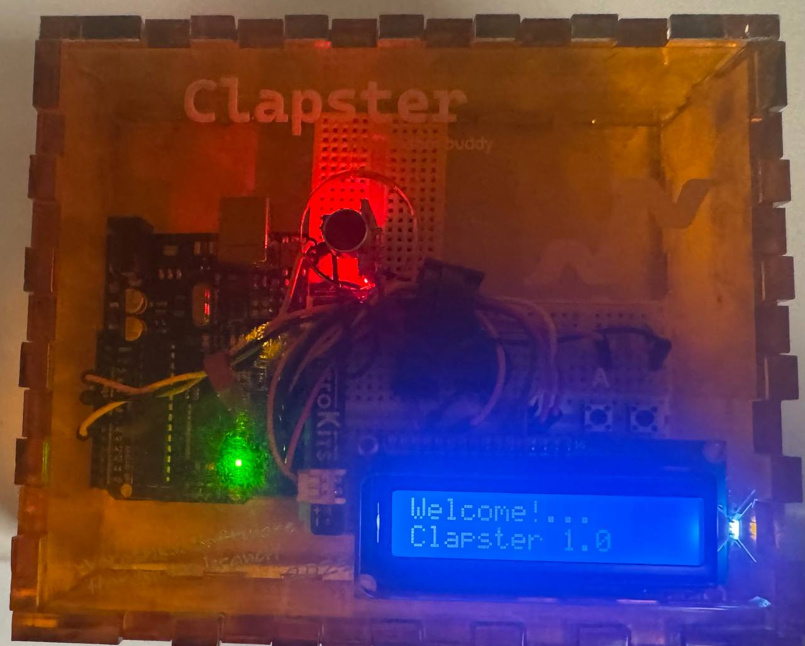

# Clapster: A Physical Rhythm Training Device

Clapster is an interactive rhythm–learning tool that listens to claps, detects rhythmic patterns, compares them to stored “master” patterns, and provides real-time feedback through an LCD display and audio cues.  
It was developed as part of the **Prototyping Interactive Systems** course at Georgia Tech.

The project integrates **audio sensing**, **pattern–matching algorithms**, **LCD UI design**, **EEPROM storage**, and **gamified interaction modes** to help users practice timing and rhythmic accuracy.
The code is in `Clapster.ino`.

<a href="https://youtu.be/xb7TcXlH2yw" target="_blank" rel="noopener noreferrer">
🎥 Watch the demo video on YouTube
</a>

---

## Features

- **Microphone-based clap detection**  
  Detects peaks in audio signal and extracts timing intervals.

- **Interval normalization algorithm**  
  Compares user input to target rhythm independent of tempo.

- **Persistent pattern storage (EEPROM)**  
  A user-recorded pattern survives resets/power cycles.

- **LCD interface with dynamic UI**  
  Status messages, instructions, animations, success/failure screens.

- **Audio feedback (buzzer)**  
  Clicks, short melodies, success/failure cues.

- **Two modes of operation:**
  1. **Learning Mode** — Record, replay, and practice a rhythm.  
  2. **Gaming Mode** — Three increasingly difficult built-in rhythms, three lives, progression-based gameplay.

- **Two-button interaction system**  
  - **A** — Ready/Start/Playback/Cancel recording/Confirm  
  - **B** — Mode switching (Learning ↔ Gaming)

---

## How It Works

### Rhythm Detection Pipeline
1. Listen for amplitude peaks from the microphone.  
2. Extract time intervals between consecutive claps.  
3. Normalize intervals to make rhythms tempo-independent.  
4. Compare user rhythm against stored pattern using tolerance thresholds.  
5. Output evaluation:
   - LCD message  
   - Buzzer feedback melody  

---

## Operating Modes

### **1. Learning Mode**
- Replay the stored “key” rhythm pattern.
- User performs it by clapping.
- Device evaluates accuracy.
- Button **A**:
  - Click → Playback stored pattern  
  - Long press → Enter Recording Mode  
  - Press again → Cancel recording
---

### **2. Gaming Mode**
- Three built-in rhythm levels.
- User gets **3 lives total**.
- Each attempt:
  - Rhythm is played via buzzer.
  - LCD shows numeric representation.
  - User performs pattern.
- Button **A** = “Ready”.
- Button **B** = Switch modes anytime.
---

## Hardware Components

- Arduino Uno  
- Sensor detection module (mic) 
- 16×2 LCD (with potentiometer for contrast)  
- Buzzer  
- 2× push buttons  
- 2x resistors for the buttons
- Battery pack (3×AA)  
- Jumper wires + breadboard  
- Laser-cut acrylic enclosure  

---
### All connections in the projects are customizable, what I did can be found in `CONNECTIONS.md`. 
### Photos of both breadboard prototype and final laser-cut enclosure available in `images/`.

